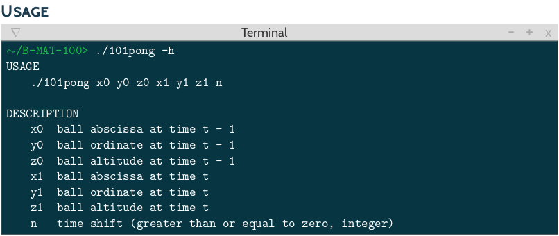
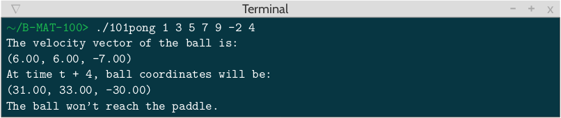
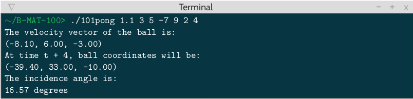
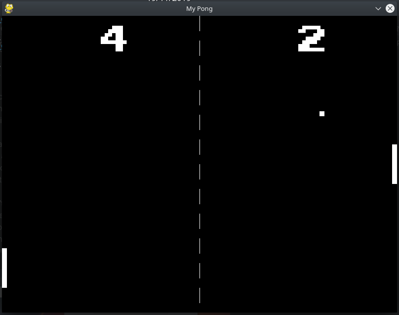

# 101pong
> Mathematical Project

> Work on a 3D version of the famous game Pong

> 2 students, made with [Tristan Bourgeois](https://www.linkedin.com/in/tristan-bourgeois-821b5b196/)

- [Description](#description)
- [Examples](#examples)
- [Grade](#grade)
- [Bonus](#bonus)

### Description

The program must print :
- The velocity vector of the ball
- The coordinates of the ball after a time shift n
- The angle at which the ball will hit the paddle (if it will actually hit it, at anytime from t = 0).

### Examples

### Grade

Marvin couldn't find our unit tests.
Only the case when the incidence angle was equal to zero was not treated.

### Bonus

There is a complete 2D Pong made in pygame as a bonus located in the bonus directory :

