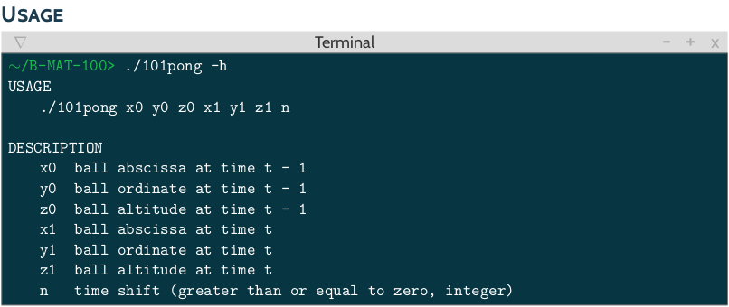
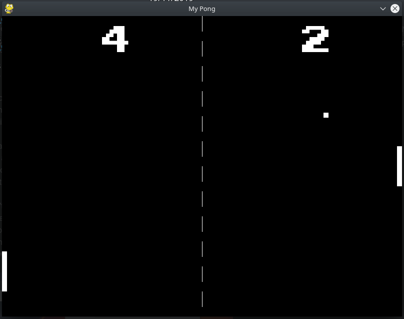

## 101pong_2019

The program must print :
- The velocity vector of the ball
- The coordinates of the ball after a given amount of time
- The angle at which the ball will hit the paddle (if it will actually hit it, at anytime from t = 0).

Only the case when the incidence angle is equal to zero is not treated.

There is a a complete 2D Pong in pygame made as a bonus in the bonus directory :

